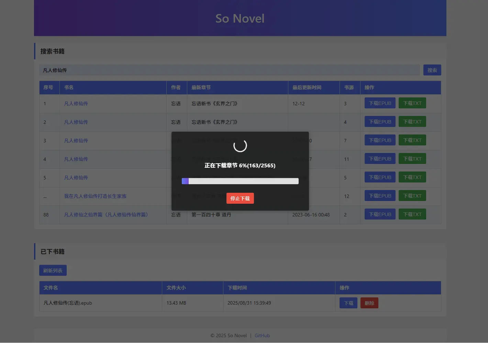

# Go Novel (So Novel Go版本)

这是一个用Go语言重新实现的So Novel小说下载器，旨在减少服务器资源占用，同时尽量保持与原Java版本相同的规则兼容性。

> ⚠️ **重要声明**：本项目是基于 [freeok/so-novel](https://github.com/freeok/so-novel) (Java版本) 重构的Go语言版本。原项目采用 [GNU Affero General Public License v3.0](https://github.com/freeok/so-novel/blob/main/LICENSE) 开源协议。根据AGPL-3.0许可证的要求，本项目也必须采用相同的许可证。

> ❗ **免责提示**：本项目仅供学习与技术研究使用。使用前请认真阅读[法律免责声明](#法律免责声明-legal-disclaimer)，并确保遵守相关法律法规。

## 特性

- 📚 聚合搜索：支持从多个小说源搜索书籍
- ⚡ 高性能：使用Go语言实现，资源占用更少
- 🌐 Web界面：提供友好的Web用户界面
- 📖 多格式支持：支持EPUB、TXT格式
- 🔧 规则兼容：兼容原Java版本的规则文件
- 🔄 实时进度：使用SSE（Server-Sent Events）实时显示下载进度
- ⚙️ 灵活配置：支持丰富的配置选项，包括代理、限流等

## 技术栈

- **后端**: Go + Gin框架
- **前端**: HTML + CSS + 原生JavaScript
- **实时通信**: SSE (Server-Sent Events)
- **配置管理**: Viper
- **HTML解析**: GoQuery
- **EPUB生成**: go-epub库

## 嵌入资源机制

本项目采用Go语言的`embed`特性，将配置文件、规则文件和静态资源直接嵌入到可执行文件中。这种设计有以下优势：

1. **零依赖部署**：可执行文件包含所有必要资源，无需额外的配置文件即可运行
2. **自动恢复**：当外部配置文件缺失时，程序会自动使用嵌入的默认配置
3. **优先级机制**：当外部配置文件存在时，优先使用外部文件，便于用户自定义

### 嵌入资源说明

- **配置文件**：`configs/config.ini` 包含程序运行的基本配置
- **规则文件**：`configs/rules/` 目录下的所有JSON文件，定义了小说源的爬取规则
- **静态资源**：`internal/embed/static/` 目录下的Web界面文件（HTML、CSS、图标等）

### 运行时行为

1. 程序启动时会检查 `configs/` 目录是否存在配置文件
2. 如果配置文件存在，则使用外部文件
3. 如果配置文件不存在，则使用嵌入的默认文件, 并生成默认的配置文件
4. 这种机制确保程序在任何环境下都能正常运行，同时保留了用户自定义配置的能力

## 目录结构

```
go-novel/
├── assets/            # 资源文件
    ├── configs.tar.gz # 默认配置和规则文件
│   └── webui-preview.jpg # Web UI 预览图
├── configs/           # 配置文件（运行时生成）
│   ├── config.ini     # 主配置文件
│   └── rules/         # 规则文件
├── internal/          # 内部模块
│   ├── config/        # 配置管理
│   ├── core/          # 核心爬虫逻辑
│   ├── embed/         # 嵌入资源
│   │   ├── embed.go   # 嵌入的配置、规则和静态文件
│   │   ├── configs/   # 嵌入文件的源文件（编译时使用）
│   │   │   ├── config.ini
│   │   │   └── rules/
│   │   └── static/    # 嵌入的静态文件源文件（编译时使用）
│   │       ├── css/
│   │       ├── favicon.ico
│   │       └── index.html
│   ├── handler/       # HTTP请求处理
│   ├── model/         # 数据模型
│   ├── rules/         # 规则管理
│   ├── sse/           # SSE实时通信
│   ├── util/          # 工具函数
│   └── web/           # Web服务器
├── downloads/         # 下载文件目录
├── go.mod             # Go模块文件
├── go.sum             # Go依赖校验文件
├── main.go            # 程序入口
└── README.md          # 说明文档
```

## 安装与运行

### 环境要求

- Go 1.25+
- Git

### 安装步骤

1. 克隆项目：
   ```bash
   git clone https://github.com/zsyo/go-novel
   cd go-novel
   ```

2. 初始化Go模块：
   ```bash
   go mod tidy
   ```

3. 运行程序：
   ```bash
   go run main.go
   ```

4. 访问Web界面：
   打开浏览器访问 `http://localhost:7765`

## Docker部署

项目提供了 [build-docker.sh](build-docker.sh) 脚本用于构建Docker镜像，该脚本会自动编译Go程序并构建最小化的Docker镜像。

### 环境要求

- Docker
- Go 1.25+ (用于编译二进制文件)
- UPX (可选，用于压缩二进制文件)

### 构建步骤

运行 [build-docker.sh](build-docker.sh) 脚本即可自动完成编译和构建：

```bash
./build-docker.sh
```

脚本将执行以下操作：
1. 编译Go程序为Linux平台的二进制文件
2. 使用UPX压缩二进制文件（如果已安装UPX）
3. 构建Docker镜像
4. 清理临时文件

### 运行容器

构建完成后，可以使用以下命令运行容器：

```
# 基本运行
docker run -d --user=$(id -u):$(id -g) -p 7765:7765 --name go-novel go-novel:latest

# 挂载本地配置目录
docker run -d \
   --user=$(id -u):$(id -g) \
   -p 7765:7765 \
   -v $(pwd)/configs:/app/configs \
   --name go-novel \
   go-novel:latest

# 挂载本地下载目录
docker run -d \
   --user=$(id -u):$(id -g) \
   -p 7765:7765 \
   -v $(pwd)/downloads:/app/downloads \
   --name go-novel \
   go-novel:latest

# 同时挂载配置和下载目录
docker run -d \
   --user=$(id -u):$(id -g) \
   -p 7765:7765 \
   -v $(pwd)/configs:/app/configs \
   -v $(pwd)/downloads:/app/downloads \
   --name go-novel \
   go-novel:latest

# 同时挂载配置和下载目录（精细挂载配置、规则目录）
docker run -d \
   --user=$(id -u):$(id -g) \
   -p 7765:7765 \
   -v $(pwd)/configs/config.ini:/app/configs/config.ini \
   -v $(pwd)/configs/rules:/app/configs/rules \
   -v $(pwd)/downloads:/app/downloads \
   --name go-novel \
   go-novel:latest
```

### 使用预构建的Docker镜像

为了方便使用，已经构建了Docker镜像并推送到了Docker Hub(仅支持linux amd64架构)，地址是：[https://hub.docker.com/r/zsyo/go-novel](https://hub.docker.com/r/zsyo/go-novel)

***新增***: 新增github Action自动构建容器(支持linux amd64架构和arm64架构) [https://ghcr.io/zsyo/go-novel](https://ghcr.io/zsyo/go-novel)

**注意**：如需挂载配置和规则,请通过以下命令下载配置文件压缩包并解压。
```bash
wget https://raw.githubusercontent.com/zsyo/go-novel/main/assets/configs.tar.gz

tar -zxvf configs.tar.gz
```

使用预构建镜像的部署命令示例：

```
# 基本运行
  dockerHub版:
    docker run -d -p 7765:7765 --name go-novel zsyo/go-novel:latest
  ghcr.io版:
    docker run -d -p 7765:7765 --name go-novel ghcr.io/zsyo/go-novel:latest

# 挂载本地配置目录
  dockerHub版:
    docker run -d \
      --user=$(id -u):$(id -g) \
      -p 7765:7765 \
      -v $(pwd)/configs:/app/configs \
      --name go-novel \
      zsyo/go-novel:latest
  ghcr.io版:
    docker run -d \
      --user=$(id -u):$(id -g) \
      -p 7765:7765 \
      -v $(pwd)/configs:/app/configs \
      --name go-novel \
      ghcr.io/zsyo/go-novel:latest

# 挂载本地下载目录
  dockerHub版:
    docker run -d \
      --user=$(id -u):$(id -g) \
      -p 7765:7765 \
      -v $(pwd)/downloads:/app/downloads \
      --name go-novel \
      zsyo/go-novel:latest
  ghcr.io版:
    docker run -d \
      --user=$(id -u):$(id -g) \
      -p 7765:7765 \
      -v $(pwd)/downloads:/app/downloads \
      --name go-novel \
      ghcr.io/zsyo/go-novel:latest

# 同时挂载配置和下载目录
  dockerHub版:
    docker run -d \
      --user=$(id -u):$(id -g) \
      -p 7765:7765 \
      -v $(pwd)/configs:/app/configs \
      -v $(pwd)/downloads:/app/downloads \
      --name go-novel \
      zsyo/go-novel:latest
  ghcr.io版:
    docker run -d \
      --user=$(id -u):$(id -g) \
      -p 7765:7765 \
      -v $(pwd)/configs:/app/configs \
      -v $(pwd)/downloads:/app/downloads \
      --name go-novel \
      ghcr.io/zsyo/go-novel:latest

# 同时挂载配置和下载目录（精细挂载配置、规则目录）
  dockerHub版:
    docker run -d \
      --user=$(id -u):$(id -g) \
      -p 7765:7765 \
      -v $(pwd)/configs/config.ini:/app/configs/config.ini \
      -v $(pwd)/configs/rules:/app/configs/rules \
      -v $(pwd)/downloads:/app/downloads \
      --name go-novel \
      zsyo/go-novel:latest
  ghcr.io版:
    docker run -d \
      --user=$(id -u):$(id -g) \
      -p 7765:7765 \
      -v $(pwd)/configs/config.ini:/app/configs/config.ini \
      -v $(pwd)/configs/rules:/app/configs/rules \
      -v $(pwd)/downloads:/app/downloads \
      --name go-novel \
      ghcr.io/zsyo/go-novel:latest
```

### Docker镜像说明

Docker镜像基于Alpine Linux构建，具有以下特点：
- 使用最小化的Alpine Linux作为基础镜像
- 创建非root用户运行程序，提高安全性
- 包含HTTPS支持所需的ca-certificates
- 暴露7765端口用于Web服务

## Web UI 界面预览

以下是本项目的Web UI界面预览：

<p align="center">
  
  
</p>

<p align="center">
  <em>左: Web UI 搜索界面 | 右: Web UI 下载界面</em>
</p>

界面功能包括：
1. **书籍搜索**：在搜索框中输入书名或作者名，点击搜索按钮进行聚合搜索
2. **书籍下载**：在搜索结果中选择书籍，点击下载按钮开始下载
3. **本地书籍管理**：查看已下载的书籍列表，支持下载和删除操作
4. **实时进度显示**：下载过程中显示实时进度条

## 配置说明

配置文件位于 `configs/config.ini`：

```ini
[download]
# 下载路径，绝对/相对路径均可
download-path = downloads
# 文件扩展名 (可选值：epub, txt，推荐 epub)
extname = epub
# 下载完成后是否保留章节缓存文件夹 (1 是，0 否)
preserve-chapter-cache = 0

[source]
# 书籍内容语言 (默认自动获取，可选值：zh_CN, zh_TW, zh_Hant)
language =
# 指定规则文件，绝对/相对路径均可
active-rules = main-rules.json
# 指定当前激活规则中的某个书源，用于指定搜索、批量下载 (填写书源 ID)
source-id = -1
# 每个书源只显示前 N 条搜索记录 (默认为全部)
search-limit = 10

[crawl]
# 爬取线程数，-1 表示自动设置
threads = -1
# 爬取最小间隔 (毫秒)
min-interval = 200
# 爬取最大间隔 (毫秒)
max-interval = 400
# 是否启用重试，不启用则下载出错时中断下载 (1 是，0 否)
enable-retry = 1
# 最大重试次数 (针对首次下载失败的章节)
max-retries = 5
# 重试爬取最小间隔 (毫秒)
retry-min-interval = 2000
# 重试爬取最大间隔 (毫秒)
retry-max-interval = 4000

[web]
# 是否开启 Web 服务 (1 是，0 否)
enabled = 1
# Web 服务端口
port = 7765

[proxy]
# 是否启用 HTTP 代理 (针对需要代理的书源。1 开，0 关)
enabled = 0
host = 127.0.0.1
port = 8118
```

## 规则文件

规则文件位于 `configs/rules/` 目录下，兼容原Java版本的JSON格式规则。

支持的规则类型：
- `main-rules.json` - 主要规则文件
- `flowlimit-rules.json` - 限流规则
- `non-searchable-rules.json` - 不支持搜索的规则
- `proxy-rules.json` - 需要代理的规则

## API接口

- `GET /api/search/aggregated` - 聚合搜索
- `GET /api/book/fetch` - 获取书籍
- `GET /api/book/download` - 下载书籍
- `GET /api/local/books` - 获取本地书籍列表
- `DELETE /api/book` - 删除书籍
- `GET /sse/book/progress` - SSE进度通知

## SSE实时进度通知

本项目使用SSE（Server-Sent Events）实现实时进度通知，通过 `/sse/book/progress` 端点推送下载进度。

## Web界面功能

1. **书籍搜索**：在搜索框中输入书名或作者名，点击搜索按钮进行聚合搜索
2. **书籍下载**：在搜索结果中选择书籍，点击下载按钮开始下载
3. **本地书籍管理**：查看已下载的书籍列表，支持下载和删除操作
4. **实时进度显示**：下载过程中显示实时进度条

## 开发计划

- [x] 基础Web服务器
- [x] 配置管理
- [x] 规则解析
- [x] HTTP请求处理
- [x] SSE实时通信
- [x] 核心爬虫逻辑实现
- [x] 文件下载与保存
- [x] 完整功能测试

## 法律免责声明 (Legal Disclaimer)

在使用本工具前，请务必仔细阅读我们的[法律免责声明](DISCLAIMER.md)。使用本工具即表示您已阅读、理解并同意遵守所有条款。

## 许可证

GNU Affero General Public License v3.0

本项目是 [freeok/so-novel](https://github.com/freeok/so-novel) 的Go语言重构版本，原项目采用 AGPL-3.0 许可证。根据 AGPL-3.0 许可证的要求：

1. 如果您修改了本项目的源代码并部署在网络服务器上供他人使用，您必须公开修改后的源代码。
2. 您可以自由使用、复制、修改和分发本软件，但必须包含原始版权声明和许可证文本。
3. 本软件按"原样"提供，不提供任何明示或暗示的担保。

完整的许可证文本请参见 [LICENSE](LICENSE) 文件。

---

**注意**：由于AGPL-3.0许可证的传染性，如果您在网络服务器上使用或修改本软件，您需要：
- 公开您对本软件所做的任何修改
- 如果您的项目是专有软件或使用不兼容的许可证，您可能需要寻求法律建议

## 第三方依赖

|    库名    |    许可证类型    |   许可证链接   |
|:-----------|:----------------:|:--------------:|
| github.com/PuerkitoBio/goquery | BSD-3-Clause | [查看](https://github.com/PuerkitoBio/goquery/blob/v1.10.3/LICENSE) |
| github.com/andybalholm/cascadia | BSD-2-Clause | [查看](https://github.com/andybalholm/cascadia/blob/v1.3.3/LICENSE) |
| github.com/antchfx/htmlquery | MIT | [查看](https://github.com/antchfx/htmlquery/blob/v1.3.4/LICENSE) |
| github.com/antchfx/xpath | MIT | [查看](https://github.com/antchfx/xpath/blob/v1.3.5/LICENSE) |
| github.com/bmaupin/go-epub | MIT | [查看](https://github.com/bmaupin/go-epub/blob/v1.1.0/LICENSE) |
| github.com/dlclark/regexp2 | MIT | [查看](https://github.com/dlclark/regexp2/blob/v1.11.5/LICENSE) |
| github.com/dop251/goja | MIT | [查看](https://github.com/dop251/goja/blob/58d95d85e994/LICENSE) |
| github.com/dop251/goja/ftoa/internal/fast | BSD-3-Clause | [查看](https://github.com/dop251/goja/blob/58d95d85e994/ftoa/internal/fast/LICENSE_V8) |
| github.com/fsnotify/fsnotify | BSD-3-Clause | [查看](https://github.com/fsnotify/fsnotify/blob/v1.9.0/LICENSE) |
| github.com/gabriel-vasile/mimetype | MIT | [查看](https://github.com/gabriel-vasile/mimetype/blob/v1.4.10/LICENSE) |
| github.com/gin-contrib/sse | MIT | [查看](https://github.com/gin-contrib/sse/blob/v1.1.0/LICENSE) |
| github.com/gin-gonic/gin | MIT | [查看](https://github.com/gin-gonic/gin/blob/v1.10.1/LICENSE) |
| github.com/go-playground/locales | MIT | [查看](https://github.com/go-playground/locales/blob/v0.14.1/LICENSE) |
| github.com/go-playground/universal-translator | MIT | [查看](https://github.com/go-playground/universal-translator/blob/v0.18.1/LICENSE) |
| github.com/go-playground/validator/v10 | MIT | [查看](https://github.com/go-playground/validator/blob/v10.27.0/LICENSE) |
| github.com/go-sourcemap/sourcemap | BSD-2-Clause | [查看](https://github.com/go-sourcemap/sourcemap/blob/v2.1.4/LICENSE) |
| github.com/gofrs/uuid | MIT | [查看](https://github.com/gofrs/uuid/blob/v4.4.0/LICENSE) |
| github.com/golang/groupcache/lru | Apache-2.0 | [查看](https://github.com/golang/groupcache/blob/2c02b8208cf8/LICENSE) |
| github.com/google/pprof/profile | Apache-2.0 | [查看](https://github.com/google/pprof/blob/f64d9cf942d6/LICENSE) |
| github.com/hashicorp/hcl | MPL-2.0 | [查看](https://github.com/hashicorp/hcl/blob/v1.0.0/LICENSE) |
| github.com/leodido/go-urn | MIT | [查看](https://github.com/leodido/go-urn/blob/v1.4.0/LICENSE) |
| github.com/magiconair/properties | BSD-2-Clause | [查看](https://github.com/magiconair/properties/blob/v1.8.7/LICENSE.md) |
| github.com/mattn/go-isatty | MIT | [查看](https://github.com/mattn/go-isatty/blob/v0.0.20/LICENSE) |
| github.com/mitchellh/mapstructure | MIT | [查看](https://github.com/mitchellh/mapstructure/blob/v1.5.0/LICENSE) |
| github.com/pelletier/go-toml/v2 | MIT | [查看](https://github.com/pelletier/go-toml/blob/v2.2.4/LICENSE) |
| github.com/sagikazarmark/slog-shim | BSD-3-Clause | [查看](https://github.com/sagikazarmark/slog-shim/blob/v0.1.0/LICENSE) |
| github.com/spf13/afero | Apache-2.0 | [查看](https://github.com/spf13/afero/blob/v1.14.0/LICENSE.txt) |
| github.com/spf13/cast | MIT | [查看](https://github.com/spf13/cast/blob/v1.9.2/LICENSE) |
| github.com/spf13/pflag | BSD-3-Clause | [查看](https://github.com/spf13/pflag/blob/v1.0.7/LICENSE) |
| github.com/spf13/viper | MIT | [查看](https://github.com/spf13/viper/blob/v1.19.0/LICENSE) |
| github.com/subosito/gotenv | MIT | [查看](https://github.com/subosito/gotenv/blob/v1.6.0/LICENSE) |
| github.com/ugorji/go/codec | MIT | [查看](https://github.com/ugorji/go/blob/codec/v1.3.0/codec/LICENSE) |
| github.com/vincent-petithory/dataurl | MIT | [查看](https://github.com/vincent-petithory/dataurl/blob/v1.0.0/LICENSE) |
| golang.org/x/crypto/sha3 | BSD-3-Clause | 无 |
| golang.org/x/net | BSD-3-Clause | 无 |
| golang.org/x/sys | BSD-3-Clause | 无 |
| golang.org/x/text | BSD-3-Clause | 无 |
| google.golang.org/protobuf | BSD-3-Clause | 无 |
| gopkg.in/ini.v1 | Apache-2.0 | [查看](https://github.com/go-ini/ini/blob/v1.67.0/LICENSE) |
| gopkg.in/yaml.v3 | MIT | [查看](https://github.com/go-yaml/yaml/blob/v3.0.1/LICENSE) |
